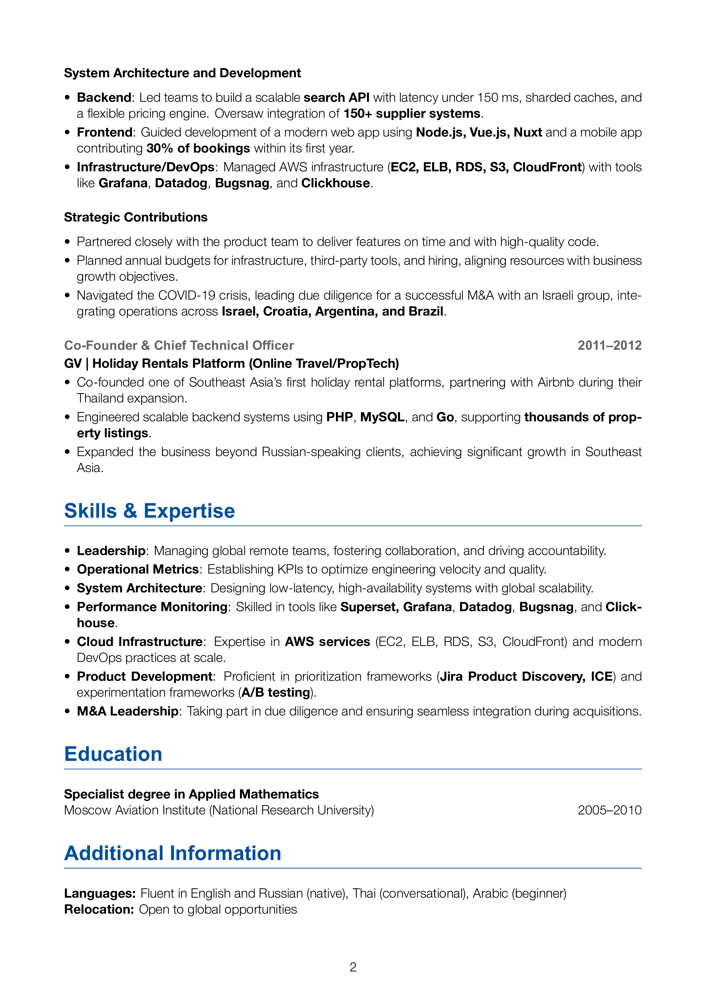

# CV - Eugene Oleinik

This repository contains the LaTeX source code and Makefile for the professional resume of Eugene Oleinik, highlighting achievements and experiences in technology leadership, engineering, and business growth.

## Example Output




## Technology Stack

- **LaTeX**: Core document preparation system
- **XeLaTeX**: LaTeX engine for modern font support
- **Packages**:
  - geometry: Page layout customization
  - hyperref: PDF metadata and links
  - fontspec: Modern font handling
  - xcolor: Custom color definitions
  - titlesec: Section formatting
  - fontawesome5: Icons
  - graphicx: Image handling
  - multicol: Multi-column layouts
  - enumitem: List customization

## Features

- **Clean and professional design**: Uses LaTeX for high-quality typesetting
- **Easy customization**: Modify the LaTeX source to update information
- **Automated PDF generation**: Build the resume using the provided Makefile

## Getting Started

### Prerequisites

- LaTeX distribution (e.g., TeX Live, MikTeX, or Overleaf)
- GNU Make (optional, for building with the Makefile)

### Installing MacTeX (for macOS users)

1. Install MacTeX using Homebrew:
   ```bash
   brew install --cask mactex
   ```
   
   Or download the installer from the MacTeX website:
   1. Visit https://www.tug.org/mactex/
   2. Download MacTeX.pkg
   3. Run the installer
   
2. Verify installation:
   ```bash
   xelatex --version
   ```

### Building the Resume

1. Clone this repository:
   ```bash
   git clone https://github.com/evoleinik/cv.git
   cd cv
   ```

2. Build the PDF:
   ```bash
   make
   ```

3. The output PDF will be available as `cv-2024.pdf`

## Customization

- Edit `cv-2024.tex` to update your resume details
- Adjust the Makefile if needed for custom build commands

## License

This project is licensed under the MIT License. Feel free to use, modify, and distribute.

## Contact

For any inquiries or feedback, please reach out to evoleinik@gmail.com